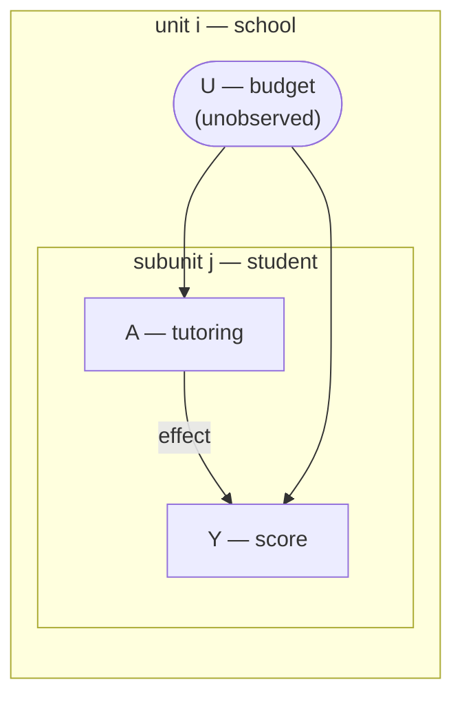

# HCM.jl

Hierarchical causal models in Julia — Weinstein & Blei (2024),
[*Hierarchical Causal Models*](https://arxiv.org/abs/2401.05330) — estimated with
[Turing](https://turing.ml/).

An HCM is a causal model with **two levels**: *units* $i$ (schools, regions, patients) and,
nested inside each, *subunits* $j$ (students, factories, cells). Treatment and outcome can live
at either level. The key fact: when treatment is measured at the subunit level, a unit-level
confounder is held fixed *within* each unit, so the subunit data acts like a natural experiment —
disaggregation turns an unidentified problem into a stratified one. HCM.jl implements the paper's
identification procedure (collapse the plated graph to a flat model over distribution-valued
*Q* variables, then apply do-calculus) and hierarchical-Bayes estimators for the worked motifs.

## What's here

  - **Four motifs** with hard and soft interventions — `:confounder`, `:confounder_interference`,
    `:nested_confounder`, `:instrument` (see [Getting Started](vignettes/getting_started.md)).
  - **A general identification engine** — hand it *any* HCM graph and it collapses, latent-projects
    to an ADMG, and runs do-calculus via
    [CausalGraphs.jl](https://github.com/xiangao/CausalGraphs.jl) to return the verdict and
    functional (see [General Identification Engine](vignettes/identification_engine.md)).
  - **A worked showcase** of why modelling interference matters
    (see [Interference vs. SUTVA](vignettes/interference_vs_sutva.md)).

## Installation

```julia
using Pkg
Pkg.add(url="https://github.com/xiangao/HCM.jl")
```

HCM.jl depends on the (unregistered) `CausalGraphs.jl`; its source is declared in HCM.jl's
`Project.toml`, so `Pkg.add` / `Pkg.instantiate` resolve it automatically.

## Two-minute tour

Take the **confounder** motif: a hidden unit-level confounder $U$ (a school's budget) drives both
who gets treated and the outcome. Treatment $A$ (tutoring) and outcome $Y$ (test score) are
subunit-level (students), inside the plate.



**The data-generating process** (`sim_hcm(:confounder)`) makes $U$ confound the treatment — it
raises both the propensity and the outcome — so the true effect is not the naive association:

```math
U_i \sim \mathcal{N}(0,1), \qquad
A_{ij} \sim \mathrm{Bernoulli}\!\big(\sigma(U_i)\big), \qquad
Y_{ij} = \beta_0 + U_i + \beta_1 A_{ij} + \varepsilon_{ij}, \quad \beta_1 = 0.5 .
```

**Is the effect identified?** Yes — a pure graph computation, instant, no sampling. Collapse the
plated graph and run do-calculus:

```@example tour
using HCM
g = hcm_graph(vertices=[:U, :A, :Y], subunit=[:A, :Y], hidden=[:U],
              di_edges=[(:U, :A), (:U, :Y), (:A, :Y)])
r = identify_hcm(g; treatment=:QA, outcome=:qy,
                 augments=[(node=:qy, parents=[:QA, :QY])])
(verdict = r.verdict, motif = r.motif)
```

`:a_fixable` means identified by a backdoor adjustment (here on the within-unit response
$Q^{y|a}$) — the paper's confounder result, and the linear special case of fixed effects.

**Recover the ATE.** Fit the motif; the posterior recovers the true $\beta_1 = 0.5$ despite the
unobserved confounder:

```julia
using HCM, DataFrames, StatsModels
sim = sim_hcm(:confounder; n=60, m=40, seed=1)
fit = hcm(@formula(y ~ a), sim.data; unit=:unit, subunit=:subunit, motif=:confounder)

summarize_ate(ate(fit, Hard(1); baseline=Hard(0)))   # posterior ATE
sim.true_hard                                         # ground truth = 0.5
```

```
posterior ATE:  mean 0.466,  95% CI [0.437, 0.494]    # covers the true 0.5
sim.true_hard = 0.5
```
