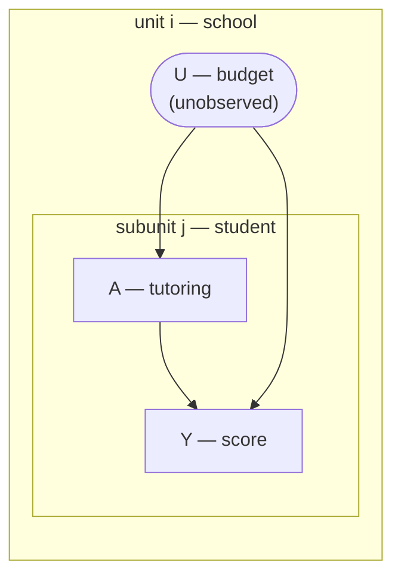
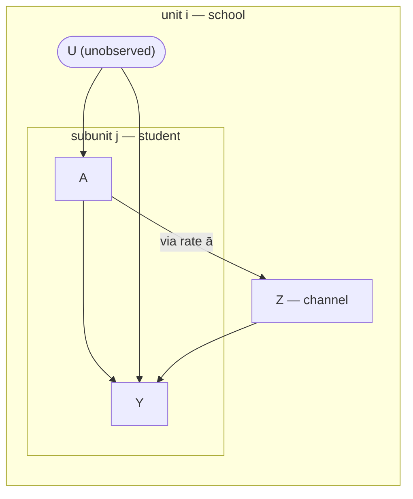
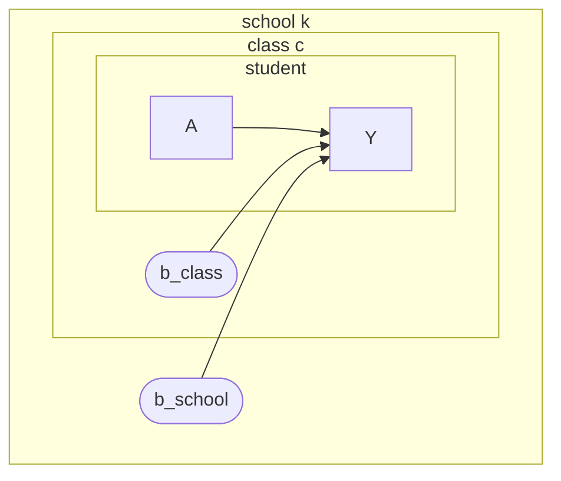
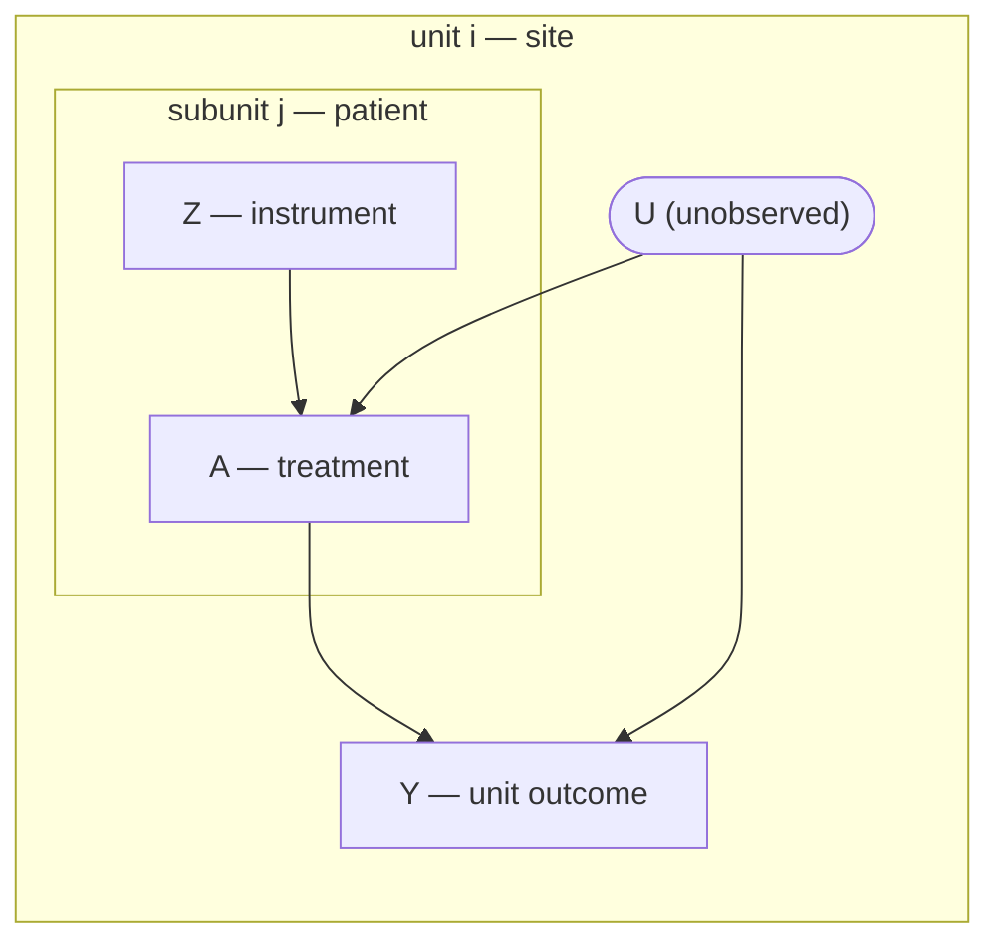

# Getting Started

This page walks through all four motifs with the same recipe each time:

1. **the graph** — the causal DAG (units, subunits, what's unobserved);
2. **the data-generating process** — the structural equations, simulated by [`sim_hcm`](@ref),
   which also returns the analytic ground-truth effect `true_hard`;
3. **identify** — collapse the graph and run do-calculus ([`identify_hcm`](@ref)) to confirm the
   effect is identified and see *how* (this part is instant — no sampling);
4. **estimate** — fit the motif with [`hcm`](@ref) and read the posterior ATE off [`ate`](@ref),
   checking it recovers `true_hard`.

The `identify` steps run live; the `hcm` fits use NUTS (minutes each) so their output is shown as
captured from a real run — every fit is runnable exactly as written.

```@setup gs
using HCM, DataFrames, StatsModels, Statistics
```

## Confounder

A school's unobserved budget `U` raises both how much tutoring a student gets and their score, so a
raw tutoring–score association is confounded. Because `U` is a *unit*-level trait, comparing
students *within* a school holds it fixed.



**DGP** (`sim_hcm(:confounder)`): the confounder enters both the propensity and the outcome, true
effect `β₁ = 0.5`.

```math
U_i \sim \mathcal{N}(0,1), \qquad
A_{ij} \sim \mathrm{Bernoulli}\!\big(\sigma(U_i)\big), \qquad
Y_{ij} = \beta_0 + U_i + \beta_1 A_{ij} + \varepsilon_{ij}.
```

**Identify** — the within-unit backdoor (a-fixable):

```@example gs
g = hcm_graph(vertices=[:U,:A,:Y], subunit=[:A,:Y], hidden=[:U],
              di_edges=[(:U,:A),(:U,:Y),(:A,:Y)])
identify_hcm(g; treatment=:QA, outcome=:qy, augments=[(node=:qy, parents=[:QA,:QY])]).verdict
```

**Estimate** — fit, then read the ATE. The posterior recovers `0.5`, and `compare_fe` shows the
linear-Gaussian HCM estimate *is* the fixed-effects slope:

```julia
sim = sim_hcm(:confounder; n=60, m=40, seed=1)
fit = hcm(@formula(y ~ a), sim.data; unit=:unit, subunit=:subunit, motif=:confounder)

summarize_ate(ate(fit, Hard(1); baseline=Hard(0)))   # posterior ATE
sim.true_hard                                         # = 0.5
compare_fe(fit)                                       # fixed-effects baseline
summarize_ate(ate(fit, Soft(1, 0.1)))                 # soft: dose 10% of subunits to a=1
```

```
hard ATE:     mean 0.466,  95% CI [0.437, 0.494]     # true_hard = 0.5, covered
compare_fe:   HCM 0.466,  Unit FE 0.463              # identical in the linear-Gaussian case
soft(1, 0.1): mean 0.024,  95% CI [0.022, 0.026]     # ≈ 0.1 × the hard effect
```

A **soft** intervention nudges the treatment *propensity* instead of forcing everyone; the gaussian
soft ATE is linear in the dose `ε` (≈ `ε · meanᵢ β₁ᵢ(a★ − pᵢ)`).

## Confounder & interference

Now a student's tutoring also raises a **unit-level channel** `Z` (school-wide class size /
discussion) that feeds back onto *every* student's score — interference, which breaks SUTVA. The
policy effect of treating everyone now runs through two paths: direct `A → Y`, and indirect
`A → ā → Z → Y`.



**DGP** (`sim_hcm(:confounder_interference)`): the unit treatment rate `ā` drives `Z`, which shifts
every outcome; `γ₁` is the interference strength.

```math
Z_i = \gamma_0 + \gamma_1 \bar a_i + \gamma_2 s_i + \eta_i, \qquad
Y_{ij} = \mu_0 + U_i + \delta_0 Z_i + (\mu_1 + \delta_1 Z_i)\,A_{ij} + \varepsilon_{ij}.
```

**Identify** — front-door through the channel (p-fixable):

```@example gs
gi = hcm_graph(vertices=[:U,:A,:Z,:Y], subunit=[:A,:Y], hidden=[:U],
               di_edges=[(:U,:A),(:U,:Y),(:A,:Y),(:A,:Z),(:Z,:Y)])
identify_hcm(gi; treatment=:QA, outcome=:qy, augments=[(node=:qy, parents=[:QA,:QY])]).verdict
```

**Estimate** — the hard ATE is the **full-do total effect**: the intervention is propagated through
`ā → Z`, so it recovers the total `true_hard`, not just the direct part:

```julia
sim = sim_hcm(:confounder_interference; n=60, m=30, seed=1)
fit = hcm(@formula(y ~ a), sim.data; unit=:unit, subunit=:subunit,
          motif=:confounder_interference, interferer=:z, unit_covar=:s, iter=600, chains=2)

summarize_ate(ate(fit, Hard(1); baseline=Hard(0)))   # total effect, incl. spillover
sim.true_hard
```

```
total ATE:  mean -0.199,  95% CI [-1.21, 0.42]       # true total = -0.338, covered
```

The interval covers the true total effect but is wide: with only $n=60$ units the channel effect
$\bar a \to z$ is hard to pin down. See [Interference vs. SUTVA](interference_vs_sutva.md) for the
exact estimand contrast and what a no-spillover analysis misses here.

## Nested confounder (three levels)

Students in classes in schools, with confounding at *both* aggregate levels. The identified effect
is the within-class effect; the Mundlak group-mean coefficients are a confounding diagnostic.



**DGP** (`sim_hcm(:nested_confounder)`): school- and class-level random effects shift both the
treatment propensity and the outcome; true within-class effect `β₁ = 0.5`.

```math
Y = \beta_0 + b^{\text{school}}_k + b^{\text{class}}_c + \beta_1 A + \varepsilon, \qquad
A \sim \mathrm{Bernoulli}\!\big(\sigma(b^{\text{school}}_k + b^{\text{class}}_c)\big).
```

**Estimate** — `nested_diagnostics` reports the Mundlak group-mean coefficients `λclass`, `λschool`
(far from zero ⇒ between-group variation is confounded, so within-class identification was the right
call):

```julia
sim = sim_hcm(:nested_confounder; n=20, m=30, seed=1)   # n schools, m students/class
fit = hcm(@formula(y ~ a), sim.data; groups=(:school, :class), motif=:nested_confounder)

summarize_ate(ate(fit, Hard(1); baseline=Hard(0)))      # within-class ATE
sim.true_hard                                           # = 0.5
nested_diagnostics(fit.draws)                           # λclass, λschool
```

```
within-class ATE:  mean 0.503,  95% CI [0.477, 0.531]   # true_hard = 0.5
λclass  = 3.29  [2.58, 4.00]    # far from 0 ⇒ between-class variation is confounded
λschool = 1.85  [0.94, 2.73]    # far from 0 ⇒ between-school variation is confounded
```

## Instrument (subunit IV, unit outcome)

A subunit-level instrument `Z` shifts treatment within each unit; the outcome `Y` is measured at the
*unit* level. The effect of the treatment rate is identified by adjusting for the
instrument-conditional propensity `q^{a|z}`.



**DGP** (`sim_hcm(:instrument)`): the confounder `U` enters treatment through the
instrument-conditional propensity `(π₀,π₁)`, the backdoor set the model adjusts for; true rate
effect `θₐ = 0.5`.

```math
Z_{ij} \sim \mathrm{Bernoulli}(\omega_i), \quad
A_{ij} \sim \mathrm{Bernoulli}\!\big(\sigma(\alpha_i + \beta_i Z_{ij})\big), \quad
Y_i = \theta_0 + \theta_{r}^{\top}(\pi_{0i},\pi_{1i}) + \theta_a\, q^a_i + \varepsilon_i,
```

where `αᵢ` depends on `Uᵢ`. **Estimate** — `compare_fe` shows the naive OLS of `Y` on the observed
rate `q^a` is biased (it omits the `q^{a|z}` adjustment):

```julia
sim = sim_hcm(:instrument; n=80, m=40, seed=1)
fit = hcm(@formula(y ~ a), sim.data; unit=:unit, subunit=:subunit, instrument=:z, motif=:instrument)

summarize_ate(ate(fit, Hard(1); baseline=Hard(0)))      # treatment-rate effect θ_a
sim.true_hard                                           # = 0.5
compare_fe(fit)                                         # naive (biased) OLS of y on q^a
```

```
rate effect θa:  mean 0.329,  95% CI [-1.03, 1.64]    # true_hard = 0.5, covered (wide — weak IV)
compare_fe:  HCM backdoor 0.329,  Naive OLS 0.957     # naive omits q^{a|z} ⇒ biased upward
```

!!! note "Weak-instrument caveat"
    The realized rate is highly collinear with the propensity adjustment set, so only the
    instrument-driven residual identifies `θₐ`. The posterior interval reliably **covers** the truth
    (the robust-IV guarantee), but the point estimate is imprecise unless the instrument is strong —
    visible as a wide interval above.

## When to use which motif

Picking a motif is a modelling decision about *your* problem, not a default. Three questions
settle it.

**1. Is the inner index an exchangeable population, or is it time?**
HCM nests *exchangeable* subunits inside units — students in schools, cells in patients. It relies
on within-unit exchangeability for the collapse to a flat model. Classic **panel data** nests *time
periods* inside units, and periods are generally **not** exchangeable (trends, dynamics, serial
correlation, ordered before/after). So HCM fits panel-*like* data when the inner index is a genuine
exchangeable population (e.g. many individuals per region-year), not the time axis itself. For
spillovers across time or space, panel/spatial methods are usually the better tool.

**2. Which effect do you actually want — direct or total?**
The motifs target different estimands:

| You want… | Motif | Estimand |
|---|---|---|
| the effect of treating *this* subunit, environment fixed | `:confounder` / `:nested_confounder` | within-unit **direct** effect |
| the policy effect of treating *everyone*, spillover included | `:confounder_interference` | **total** effect through the channel |
| a unit-level outcome, treatment shifted by a subunit instrument | `:instrument` | instrument-identified rate effect |

Neither direct nor total is "more correct" — they answer different questions.

**3. If you're tempted by interference: can you name and observe the channel?**
The interference motif identifies via a front-door adjustment *through* an observed unit-level
variable `z` (class size, enforcement intensity). If the spillover runs through something you can't
observe or name, that motif does not apply. And modelling a channel is not free:

  - When interference is **absent or weak, the interference and direct estimands coincide** (they
    meet at $\gamma_1 = 0$ in the [Interference vs. SUTVA](interference_vs_sutva.md) figure), so the
    interference model buys no bias reduction — only extra variance and assumptions. Above, the
    confounder ATE had interval width ≈ 0.06 while the interference total ATE spanned ≈ 1.6.
  - So model interference when you have a *reason* to (a plausible, observed channel) and want the
    total effect — ideally after checking the channel responds to the treatment rate
    ($\bar a \to z$) — not as a reflex. Otherwise the simpler motif is both correct and far more
    precise.
