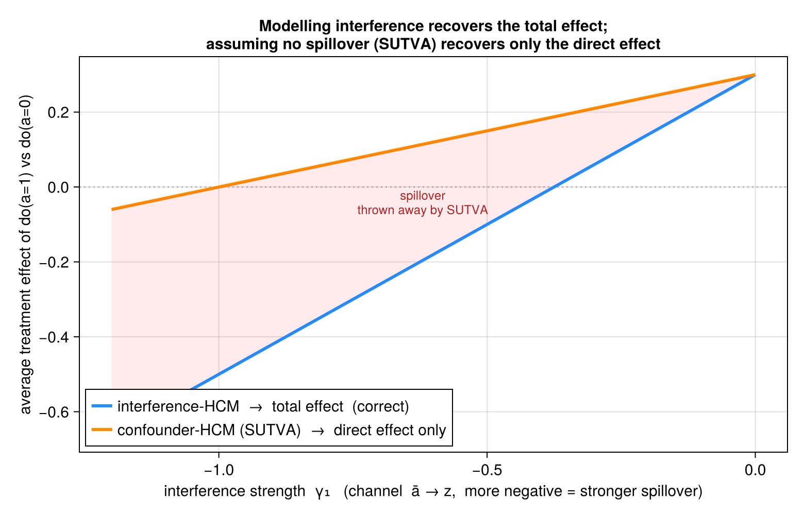

# Interference vs. SUTVA

Most causal analyses assume **no interference** — one subunit's treatment does not affect another's
outcome (part of SUTVA). When that fails, the policy-relevant effect of treating everyone is *not*
the within-unit comparison those analyses estimate. This vignette shows what modelling the
interference channel buys you, and what assuming it away costs.

## The setup

In the [`confounder_interference`](@ref sim_hcm) data-generating process, each subunit's treatment
$a_{ij}$ lifts the unit treatment rate $\bar a_i$, which drives a **unit-level channel** $z_i$ (e.g.
school-wide class size, region-wide enforcement), which feeds back onto *every* subunit's outcome:

```math
z_i = \gamma_0 + \gamma_1\,\bar a_i + \gamma_2\, s_i, \qquad
y_{ij} = \mu_0 + u_i + \delta_0 z_i + (\mu_1 + \delta_1 z_i)\,a_{ij} + \varepsilon_{ij}.
```

$\gamma_1$ is the **interference strength**: how strongly the unit's treatment rate moves the
channel. The policy question — *what happens if we set everyone's treatment to 1?* — has a total
effect that runs through **two** paths: the direct $a_{ij}\to y_{ij}$, and the indirect
$a_{ij}\to\bar a_i\to z_i\to y_{ij}$ that reaches all subunits.

## The estimand is where the advantage lives

We do not need a simulation to see the gap — it is exact for this DGP. Setting the whole unit to
$a^\star$ moves $\bar a_i$ to $a^\star$, so the channel shifts too; averaging the outcome over the
induced channel gives the **total** effect. Holding the channel at its observed value (what an
analysis that assumes no spillover does) gives only the **direct** effect:

```math
\underbrace{\tau_{\text{total}}(\gamma_1) = \mu_1 + (\delta_0+\delta_1)\,\gamma_1}_{\textbf{interference-HCM target}}
\qquad
\underbrace{\tau_{\text{direct}}(\gamma_1) = \mu_1 + \delta_1\,p_a\,\gamma_1}_{\textbf{SUTVA confounder-HCM target}}
```

With the package defaults $\mu_1=0.3,\ \delta_0=0.2,\ \delta_1=0.6,\ p_a=0.5$ they coincide at
$\gamma_1=0$ and fan apart linearly — the spillover $(\delta_0+p_a\delta_1)\gamma_1$ is exactly what
the SUTVA analysis discards:

| $\gamma_1$ | interference-HCM (total) | SUTVA confounder-HCM (direct) | spillover gap |
|---|---|---|---|
| 0.0  |  0.300 |  0.300 |  0.000 |
| −0.3 |  0.060 |  0.210 | −0.150 |
| −0.6 | −0.180 |  0.120 | −0.300 |
| −0.9 | −0.420 |  0.030 | −0.450 |
| −1.2 | −0.660 | −0.060 | −0.600 |

At $\gamma_1=-0.8$ the SUTVA analysis reports a small *positive* effect (+0.06) when the true total
effect is clearly negative (−0.34): strong enough interference flips the sign of the conclusion.



The blue line (interference-HCM) is the true total effect; the orange line (confounder-HCM, which
assumes no spillover) tracks only the direct effect; the shaded wedge between them is the discarded
spillover.

A note on **naive aggregate OLS** (regressing unit-mean $y$ on unit-mean $a$): we deliberately leave
it *off* the figure. In this DGP treatment is randomized ($a \perp u$), so the aggregate slope
happens to absorb the channel path and tracks the *total* effect — which would misleadingly suggest
it is a sound method. It is not: with any confounding of treatment by $u$ it is biased, and the unit
treatment rate barely varies under random assignment so it is poorly identified. The principled
estimate of the total effect is the interference-HCM; the instructive contrast is interference-HCM
versus the SUTVA confounder-HCM.

## The estimators achieve these targets

The closed-form targets above are not just theory — the package's hierarchical-Bayes estimators
recover them at adequate sample size. Fit both motifs to the *same* interference data at
$\gamma_1=-0.8$ ($n=150$ units, $m=100$ subunits) and the interference-HCM lands on the total
effect while the confounder-HCM lands on the direct effect:

```julia
using HCM, DataFrames, StatsModels, Statistics
sim = sim_hcm(:confounder_interference; n=150, m=100, seed=20, params=(γ1=-0.8,))
sim.true_hard                                        # total target ≈ -0.32

# models the channel → total effect ≈ τ_total(-0.8)
fi = hcm(@formula(y ~ a), sim.data; unit=:unit, subunit=:subunit,
         motif=:confounder_interference, interferer=:z, unit_covar=:s, iter=600, chains=2)
summarize_ate(ate(fi, Hard(1); baseline=Hard(0)))

# assumes no spillover → direct effect only ≈ τ_direct(-0.8) = 0.06
fc = hcm(@formula(y ~ a), sim.data; unit=:unit, subunit=:subunit, motif=:confounder,
         iter=600, chains=2)
summarize_ate(ate(fc, Hard(1); baseline=Hard(0)))
```

The interference-HCM posterior is centred on the total effect (`sim.true_hard`, here ≈ −0.32),
while the confounder-HCM posterior is centred near the direct effect (≈ 0.06) — exactly the two
lines in the figure. The interference motif's recovery of `true_hard` is exercised over the full DGP
by the `test_interference` recovery test in the package suite; the runnable confirmation script is
[`examples/interference_confirm.jl`](https://github.com/xiangao/HCM.jl/blob/master/examples/interference_confirm.jl).

## Takeaway

When treatment spills over through a unit-level channel, **modelling the interference** — letting
the intervention propagate through $\bar a_i \to z_i$ — recovers the total, policy-relevant effect.
**Assuming no spillover** (SUTVA), even with a correct within-unit confounding adjustment, silently
estimates only the direct effect; the error is the spillover, and it grows with the interference
strength until it can reverse the sign of the answer. The full, reproducible figure script is
[`examples/interference_showcase.jl`](https://github.com/xiangao/HCM.jl/blob/master/examples/interference_showcase.jl);
the confirming fit is `examples/interference_confirm.jl`.
